<p align="center">
  
</p>

<p align="center">
  <em>An English-like functional language, inspired by COBOL and OCaml.</em>
</p>

<p align="center">
  
  
  
</p>

---

## What is Dew?

Dew is a high-level programming language with readable, English-like syntax. It borrows
its verbosity and clarity from COBOL and its functional core from OCaml, and it runs on a
tree-walking interpreter written in C++ and C.

The project is a hands-on exploration of compiler and interpreter design, object-oriented
programming, and memory management.

## Example

```dew
DEFINE FUNCTION square TAKING n AS
  RETURN n TIMES n
END

DISPLAY square OF 7
```

> Replace this with real Dew code once the syntax settles — a working example is the first
> thing anyone looks for.

## Features

- **English-like syntax** — code reads close to plain prose.
- **Functional core** — first-class functions, immutability, and OCaml-inspired semantics.
- **Object-oriented support** — classes, encapsulation, and object interaction.
- **Automatic memory management** — heap-allocated objects are reclaimed at program termination.
- **Optional manual control** — free resources explicitly when you need to.
- **Extensible runtime** — designed for experimenting with new features and execution models.

## Getting started

### Requirements

- A C++17 compiler (`g++` or `clang++`)
- `make` (or CMake, if that's what the build uses)

### Build

```bash
git clone https://github.com/brobinson1000/Dew-Language.git
cd Dew-Language
make
```

### Run

```bash
./dew examples/hello.dew
```

Or start the REPL:

```bash
./dew
```

> Adjust the build and run commands to match the actual targets in the repo.

## Project layout

```
src/        interpreter, parser, and AST
include/    public headers
examples/   sample Dew programs
assets/     logo and branding
```

## Design notes

**Interpreter pipeline.** Source is tokenized, parsed into an abstract syntax tree, then
walked by the evaluator. Errors are reported with line and column information.

**Memory.** Objects are heap-allocated and tracked by the runtime, which releases them at
program exit. A manual free is available for programs that need tighter control.

## Roadmap

- [ ] `Math_Utils` standard module
- [ ] `Unix_Utils` standard module
- [ ] `clang-tidy` and `clang-format` configuration
- [ ] Test suite
- [ ] Language reference documentation

## Contributing

Issues and pull requests are welcome. For larger changes, open an issue first to discuss
the direction.

## License

MIT — see [LICENSE](LICENSE).
